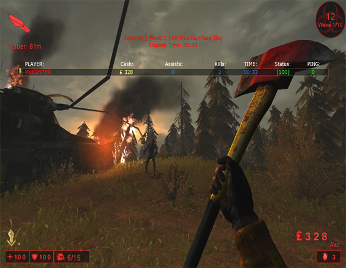

# MagisterScoreboard - mutator for killing floor 1.

**Features:**
 + 1. Support more players.
 + 2. New colors.
 + 3. Better design.

**Status:**
 + 1. Mutator whitelisted official (on classic servers players can levelup perks without lost progress).
 
**PS:**
 + 1. Else you want compile be careful cause mutator then comming to greylist.
 + 2. There only source code, release you can found in cache folder KF1 after subscribe on workshop page.

[STEAM WORKSHOP](https://steamcommunity.com/sharedfiles/filedetails/?id=248153601)
